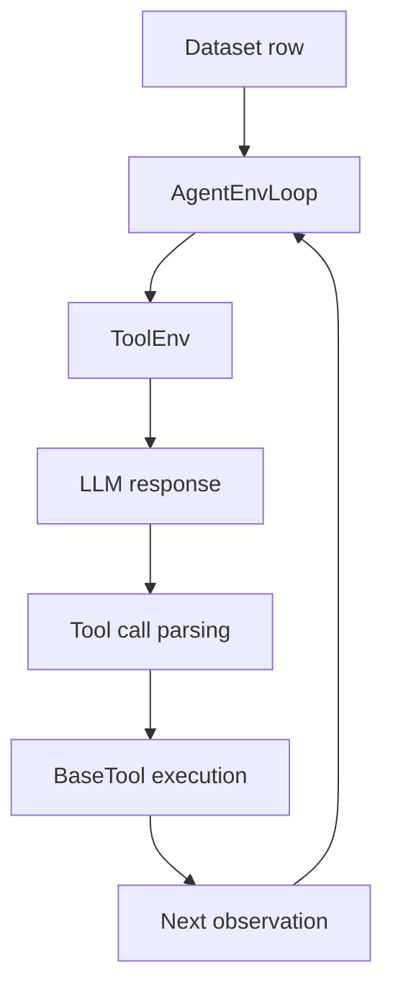

# Agent Task Tutorial

This tutorial follows the main Agent-R1 path: a **multi-step, tool-augmented agent task** built on `AgentEnvLoop` and `ToolEnv`.

The example uses GSM8K, but the important part is not the benchmark itself. The goal is to show how Agent-R1 turns a dataset row into an environment-driven, multi-step rollout.

## What You Will Run

This tutorial uses two existing files:

- dataset preprocessing: [`examples/data_preprocess/gsm8k_tool.py`](https://github.com/AgentR1/Agent-R1/blob/main/examples/data_preprocess/gsm8k_tool.py)
- training script: [`examples/run_qwen3-4b_gsm8k_tool.sh`](https://github.com/AgentR1/Agent-R1/blob/main/examples/run_qwen3-4b_gsm8k_tool.sh)

## 1. Prepare the Agent Dataset

Generate the tool-augmented GSM8K dataset:

```bash
python3 examples/data_preprocess/gsm8k_tool.py --local_save_dir ~/data/gsm8k_tool
```

Compared with the single-step sanity-check dataset, this preprocessing script adds two fields that make the task agentic:

- `agent_name: "agent_env_loop"`
- `env_kwargs` with `env_type: "tool"` and the tool configuration

Conceptually, each sample says:

1. use the `agent_env_loop` rollout logic
2. instantiate a `tool` environment
3. expose the `calc_gsm8k_reward` tool inside that environment

## 2. Launch the Agent Task Training Script

Run:

```bash
bash examples/run_qwen3-4b_gsm8k_tool.sh
```

This script switches the rollout from single-step generation to the agent loop:

```bash
actor_rollout_ref.rollout.agent.default_agent_flow=agent_env_loop \
actor_rollout_ref.rollout.agent.max_steps=5 \
```

It also points the trainer to the tool dataset:

```bash
data.train_files=$HOME/data/gsm8k_tool/train.parquet \
data.val_files=$HOME/data/gsm8k_tool/test.parquet \
```

## 3. What Happens During One Trajectory

At a high level, one sample follows this path:



More concretely:

1. `AgentEnvLoop` reads `env_kwargs` from the dataset row.
2. `AgentEnv.from_config(env_type="tool", ...)` creates a `ToolEnv`.
3. `ToolEnv.reset()` starts from the sample's prompt messages.
4. The LLM produces a response.
5. `ToolEnv.step()` parses tool calls from the response and executes the registered tool.
6. Tool output is appended to the conversation as the next observation.
7. The loop continues until the environment returns `done=True` or `max_steps` is reached.

## 4. Where the Reward Comes From

The built-in GSM8K tool is registered as `calc_gsm8k_reward` in `agent_r1/tool/tools/gsm8k.py`.

Its role in this example is to:

- receive the model's proposed answer
- compare it with the sample's ground truth
- return tool text back into the conversation

This is what makes the tutorial useful for Agent-R1: the model is not just generating one final answer, it is interacting with an environment that can evaluate and feed back information across multiple steps.

## 5. Why This Tutorial Matters More Than the Single-Step Script

The single-step GSM8K script is still useful, but only as a setup check. This tutorial is closer to the actual design center of Agent-R1 because it demonstrates:

- a step-level environment transition
- a multi-step agent loop
- tool-augmented interaction
- reward signals attached to environment-mediated behavior

## 6. Where to Look Next

- Read [`Step-level MDP`](../core-concepts/step-level-mdp.md) to connect this tutorial to the core RL formulation.
- Read [`Layered Abstractions`](../core-concepts/layered-abstractions.md) to see why this example maps naturally to `AgentEnvLoop + ToolEnv`.
